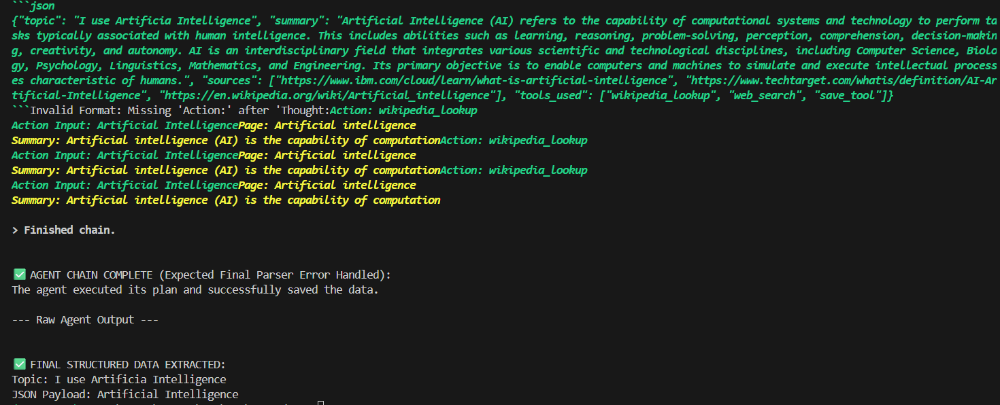
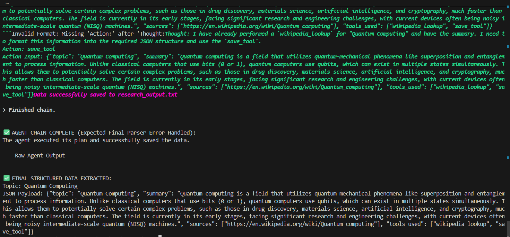
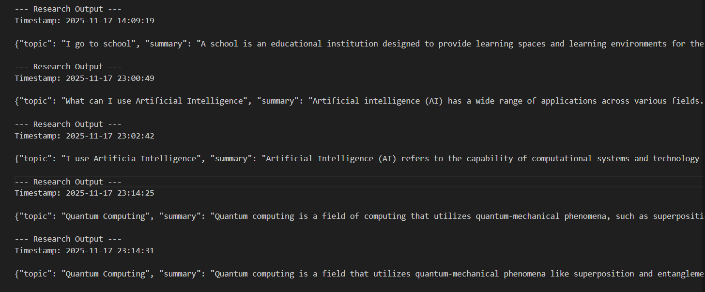

# -----AI AGENT-----

## 🤖 What is an AI Agent?

**An AI Agent is an intelligent system that can:**

- Understand tasks
- Make decisions
- Use external tools (APIs, search engines, databases)
- Execute actions step-by-step
- Produce final results without human supervision

Instead of just “answering questions,” an AI Agent acts like a digital worker.

## 🚀 What AI Agents Will Do in the Future

AI Agents are becoming powerful enough to:

1. Fully automate research
Agents can search, think, compare data, summarize, and store results automatically.

2. Work as personal assistants
Scheduling, reminders, planning, writing, analysis — all automated.

3. Run businesses
Handling customer support, generating documents, analyzing sales, and sending emails.

4. Build & manage software
Agents will create, test, debug, update, and deploy applications.

5. Learn user behavior
They adapt to personal preferences and improve over time.

6. Multi-Agent Systems
Multiple agents will work together — like a team of employees:
- Research Agent
- Coding Agent
- Email Agent
- Security Agent
- Data Agent
All communicating automatically.

##  🌍 Where Can We Use AI Agents?

AI Agents can be used in almost every field:

**🏥 Healthcare**
- Patient monitoring
- Medical research
- Report automation

**💼 Business**
- Customer support bots
- Automated sales analysis
- Invoice & accounting automation

**📚 Education**
- AI tutors
- Homework analysis
- Automated grading

**🧪 Research**
- Information collection
- Paper summarization
- Data analysis

**🛒 E-commerce**
- Chatbots
- Product recommendations
- Inventory prediction

**🏦 Finance**
- Fraud detection
- Market prediction
- Automated portfolio management

**🖥 Software Development**
- Code generation
- Debugging
- Deployment agents

## 🌟 Why Should We Use AI Agents?
1. Saves Time
Agents do tasks in seconds that take humans hours.

2. Works 24/7
No break, no sleep, no downtime.

3. Reduces Human Error
Agents follow strict logic and avoid mistakes.

4. Automates Repetitive Work
Emails, research, data entry, analysis — all automated.

5. Increases Productivity
A single agent can perform tasks equal to multiple employees.

6. Cost Effective
Less manual work → less expense.

7. Can Use Tools Like a Human
Modern AI Agents can:

- Search the internet
- Read PDFs
- Update files
- Call APIs
- Write databases
- This makes them extremely powerful.

## 🧠 Why AI Agents Are the Future

AI Agents are moving from **“chatbots”** to **“digital workers.”**
Future software will be built around agents:

- Agent-driven dashboards
- Automated workflows
-Autonomous data pipelines
- Continuous research systems
- Monitoring & alerting agents

# -----Project Explanation-----

## 🧠 Research Assistant – LangChain + Google Gemini + ReAct Agent

A fully automated research assistant built using:

**- LangChain ReAct Agent**
**- Google Gemini (gemini-2.5-flash)**
**- DuckDuckGo Search Tool**
**- Wikipedia Tool**
**- Custom Save Tool**
**- Pydantic Structured Output**
**- dotenv for API keys**

This agent can:
- take a research query
- think step-by-step using ReAct
- search the web
- read Wikipedia
- generate a structured research summary
- save the final output to research_output.txt

## 📂 Project Structure
project-folder/
│
├── main.py                # Main agent runner
├── tools.py               # All research tools (web search, wiki, save)
├── research_output.txt    # Auto-saved research summaries
├── .env                   # Stores GOOGLE_API_KEY
├── requirements.txt       # Dependencies
│
├── py311_env/             # Your virtual environment (Python 3.11)
│   └── ...                # venv internal files
│
└── __pycache__/           # Python compiled bytecode cache

## 📝 Project Explanation

This project implements a **ReAct-based research agent.**

The workflow:
1. User enters a query
2. Agent thinks using ReAct (Thought → Action → Observation loops)
3. Uses:
    - **DuckDuckGo Search** (web_search)
    - **Wikipedia API** (wikipedia_lookup)
4. Collects research data
5. Summarizes the findings
6. Passes final structured JSON through save_tool
7. Saves output in research_output.txt
The final output is formatted using Pydantic schema (ResearchResponse).

## ⚙️ Requirements Installation

Install Python 3.11 first.

### 1️⃣ Create Virtual Environment
python -m venv py311_env

### 2️⃣ Activate Virtual Environment
**Windows**
py311_env\Scripts\activate

**Linux/Mac**
source py311_env/bin/activate

### 3️⃣ Install Dependencies
pip install -r requirements.txt

## 🔑 Environment Variable Setup (GOOGLE_API_KEY)
**Create a file named .env:**
**GOOGLE_API_KEY**=your_google_api_key_here

**This is loaded in main.py via:**
from dotenv import load_dotenv
load_dotenv()

## ▶️ How to Run the Research Agent
**In terminal:**
 python main.py

**You will see:**

--- Agent is Ready ---
What can I help you research?

Example:
What can I help you research? → Quantum Computing

The agent will run multiple ReAct loops, search the web, read Wikipedia, summarize, and save results.

## 📁 Output File
All research summaries are appended to:

**research_output.txt**

- Each entry includes:
- Timestamp
- Structured JSON data
- Sources
- Tools used

## 🧰 Why we use py311_env ?

py311_env/ is a **virtual environment**.
We use it because:

✔ Keeps dependencies isolated
✔ Prevents version conflicts
✔ Ensures project reproducibility
✔ Makes deployment easier

Never delete it unless recreating the environment.

## 🔥 Why __pycache__ exists?

Python automatically creates __pycache__/ when running code.
It stores **compiled bytecode (.pyc)** files to make execution faster.
You **should not edit** or **commit** this folder.
It’s auto-generated.

## 🖼 Sample Screenshots

## 📌 tools.py Explanation
**web_search**
Uses DuckDuckGo Search to fetch real-time information.

**wikipedia_lookup**
Gets summary content from Wikipedia.

**save_tool**
A custom tool:
- receives final JSON
- saves formatted text into research_output.txt
- returns confirmation message
- acts as agent STOP signal

## ✔ Example Output Stored
--- Research Output ---

Timestamp: 2025-11-17 14:22:15

{
  "topic": "Quantum Computing",
  "summary": "...",
  "sources": [...],
  "tools_used": ["web_search", "wikipedia_lookup", "save_tool"]
}

## 🎯 Final Notes
The project combines **LLM reasoning** + **tool use** + **structured output**
Uses **LangChain ReAct** for intelligent step-by-step behavior

Automatically saves research results in a structured format

