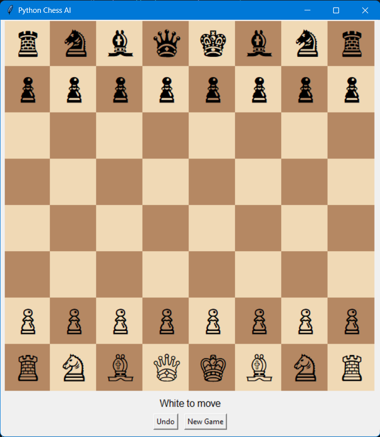

# 🧠 Python Chess AI

### 🎯 Game Overview

This is a Python-based Chess game with AI opponent built using Tkinter and the python-chess library.

  - Player can play as White or Black.
  - The AI uses Minimax algorithm with Alpha-Beta pruning for decision making.
  - Configurable AI search depth determines difficulty.

### ⚙️ How to Run the Game

1. Make sure Python 3.x is installed.
2. Install the required Python library:
  bash
    pip install python-chess
3. Save this file as chess_ai.py.
4. Open a terminal or command prompt and run:
  bash
    python chess_ai.py
5. The game window will open and you can start playing.

### 🧩 Software / Library Requirements

**✅ Required libraries:**

**tkinter** → comes pre-installed with Python
**python-chess** → for board, moves, rules (pip install python-chess)
**threading, math, random** → built-in Python modules

### 🎮 How to Play

1. Click on a piece of your turn color to select it.
2. Click on a highlighted square to move the piece.
3. Pawn promotion to Queen is automatic when reaching the last rank.
4. AI moves automatically after the player’s turn.
5. Click Undo to revert the last player + AI move.
6. Click New Game to reset the board.
7. The status bar shows whose turn it is, and alerts for check, checkmate, and stalemate.

### 🧠 Algorithm Used

**Minimax Algorithm with Alpha-Beta Pruning**
  Evaluates all legal moves up to a given depth (AI_DEPTH = 3)

Assigns piece values (Pawn=100, Knight=320, Bishop=330, Rook=500, Queen=900, King=20000)

Maximizes AI advantage while minimizing player advantage

AI Difficulty is determined by search depth; higher depth = stronger AI

### 🖼️ Screenshots

### 📊 Features

- Player vs AI gameplay
- Minimax algorithm with alpha-beta pruning
- Undo functionality for last moves
- GUI built with Tkinter
- Visual highlights for selected pieces and possible moves
- Status updates for turn, check, checkmate, stalemate

### ⏳ Algorithm Complexity
		
**Time Complexity:** O(b^d) worst case, pruned with alpha-beta	
**Space Complexity:** O(b*d)

Where:
  - b = branching factor (average legal moves)
  - d = AI search depth

### 👩‍💻 Developed Using

- **Language:** Python
- **Libraries:** Tkinter, python-chess
- **Algorithm:** Minimax with Alpha-Beta Pruning