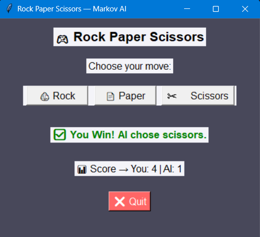

# 🧠 Rock Paper Scissors — Markov AI

### 🎯 Game Overview

This is a **Rock Paper Scissors game** with an **AI opponent** that predicts your moves using a Markov chain.

- The AI learns patterns from your last two moves to anticipate your next move.
- Player competes against the AI and scores are tracked.

### ⚙️ How to Run the Game

1. Make sure Python 3.x is installed.
2. Save this file as rock_paper_scissors_markov.py.
3. Open a terminal or command prompt and run:
   bash
      python rock_paper_scissors_markov.py
4. The GUI window will open and you can start playing.

### 🧩 Software / Library Requirements

#### ✅ Required libraries:
- **tkinter** → comes pre-installed with Python
- **collections** → built-in Python module (defaultdict)
- **random** → built-in Python module
No extra installation is required.

### 🎮 How to Play

1. Click on one of the move buttons:

  - 🪨 Rock
  - 📄 Paper
  - ✂️ Scissors
2. The AI will automatically select its move using the Markov chain prediction.
3. Results are displayed below the buttons.
4. Scores are updated after every round.
5. Click ❌ Quit to exit the game.

### 🧠 Algorithm Used

**Markov Chain AI:**
  - Tracks the last 2 player moves.
  - Uses transition counts to predict the next move.
  - Chooses a counter-move to maximize its chance of winning.

### 🖼️ Screenshots

### 📊 Features

- AI predicts player moves using Markov chains
- Scoreboard to track wins for both player and AI
- Interactive GUI using Tkinter
-  Simple buttons for easy gameplay

### ⏳ Algorithm Complexity
		
- **Predict next move:** **Time Complexity:** O(1) and **Space Complexity:** O(n²) for storing last 2-move transitions
- **AI move selection:** **Time Complexity:** O(1) and **Space Complexity:** O(1)
Where:
n = number of possible moves (3 in this game)

### 👩‍💻 Developed Using

**Language:** Python
**Library:** Tkinter
**Algorithm:** Markov Chain AI